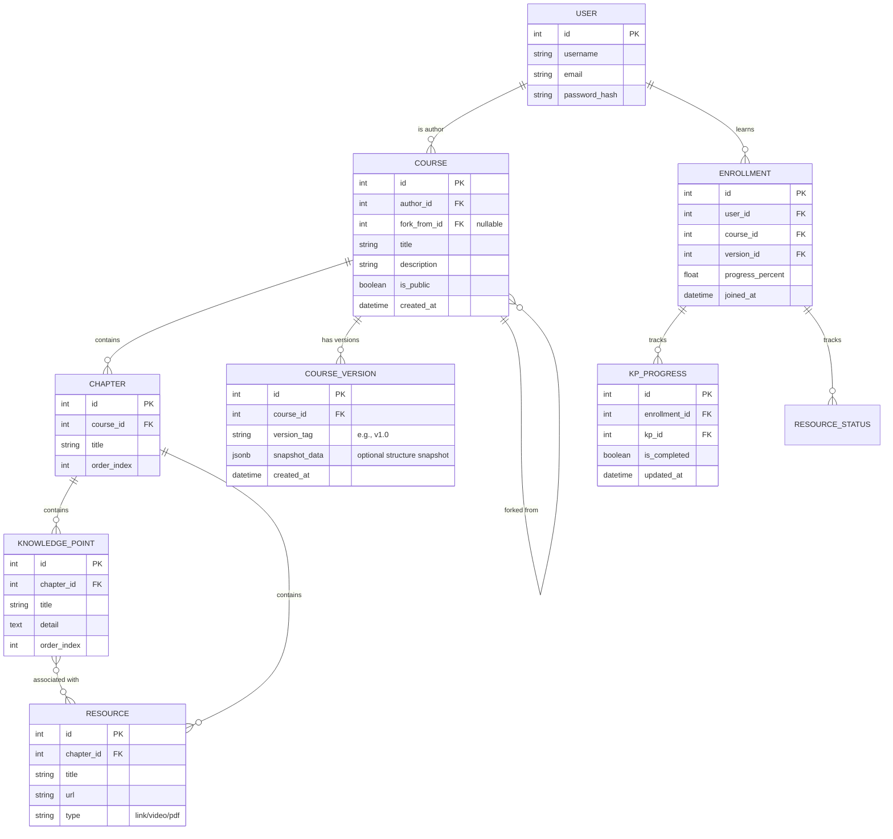

太棒了！作为架构师，我将为你夯实这最关键的第一步。数据库设计是整个系统的“地基”，一旦确定，后端的业务逻辑和前端的数据流转将顺理成章。

---

### 1. 数据库表结构设计与 ER 图

为了实现“草稿态/发布态”的分离以及“Fork”逻辑，我设计了以下方案。核心思路是：**课程本体（Course）**负责存储元数据，**章节/知识点/资源**通过外键关联课程本体，**发布版本（Version）**通过快照或版本标识来锁定内容。

#### ER 图 (Mermaid 格式)

#### 设计亮点说明：
1.  **解耦学习关系 (Enrollment)**：用户加入学习时，在 `ENROLLMENT` 表记录，并绑定具体的 `version_id`。这样即使作者修改了课程草稿，用户的进度依然基于旧版本。
2.  **Fork 机制**：`COURSE` 表中的 `fork_from_id` 指向原课程 ID，实现溯源。
3.  **多对多关联 (KP & Resource)**：一个资源可以覆盖多个知识点，一个知识点可以有多个资源。

